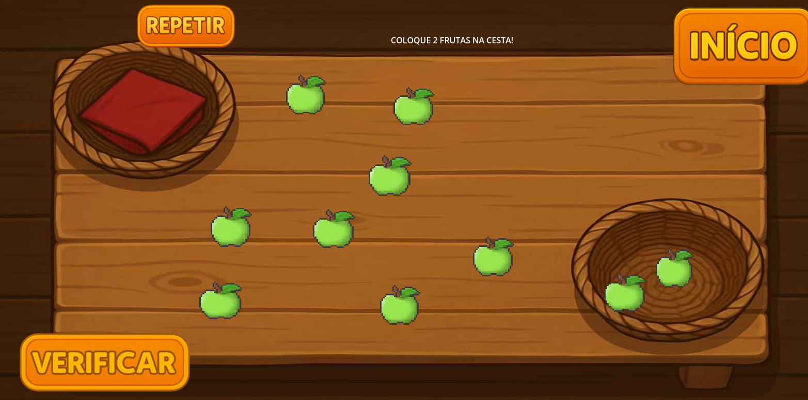
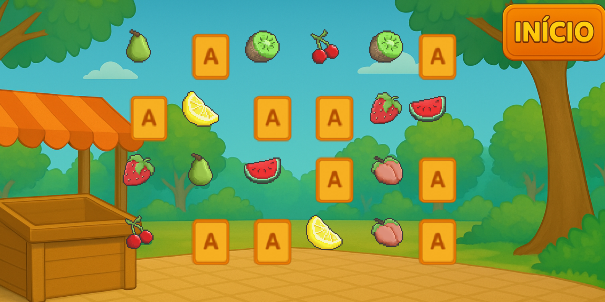
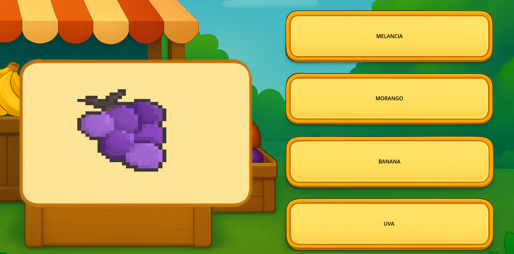

# 🎮 All Count  

🧩 **All Count** é um jogo educativo criado para alunos da **APAE**, com o objetivo de tornar o aprendizado da matemática mais acessível, divertido e inclusivo.  
Desenvolvido com **Godot Engine**, o projeto combina **design intuitivo**, **cores vibrantes** e **mecânicas simples** para promover o raciocínio lógico e a autonomia dos alunos.  

---

## 🌟 Objetivo  

Tornar a **aprendizagem matemática acessível para todos**, utilizando a tecnologia e o design como ferramentas de inclusão.  

---

## 🕹️ Modos de jogo  

🍎 **Contagem:** o jogador vê um número e deve arrastar a quantidade correspondente de frutas para a cesta.  
🍌 **Nome da fruta:** o jogador vê a imagem e escolhe o nome correto.  
🎨 **Cores:** o mesmo conceito, mas com cores.  
🧠 **Jogo da memória:** encontre os pares de frutas!  

---

## ⚙️ Tecnologias  

- 🕹️ **Godot Engine**  
- 🎨 **Design acessível** (cores contrastantes, ícones grandes e feedback visual)  
- 🧠 **Lógica simples e adaptada** para o público-alvo  

---

## 📸 Demonstração  

🎥 Assista ao vídeo de apresentação no YouTube:  
👉 [**Clique aqui para ver o All Count em ação!**](https://youtube.com/shorts/6MlwP1mmOAY)

---

## 💬 Sobre o projeto  

Esse jogo nasceu como parte de um **projeto extensionista**, unindo **tecnologia, empatia e acessibilidade**.  
O foco é mostrar como a **programação pode transformar a educação** e abrir novas formas de aprendizado para todos.  

---

## 🧑‍💻 Desenvolvido por  

**Breno Redusino (Brene)**  
💜 Apaixonado por tecnologia, acessibilidade e criação de experiências que unem lógica e arte.  

---

⭐ *Se esse projeto te inspirar, não esqueça de deixar uma estrela!*
